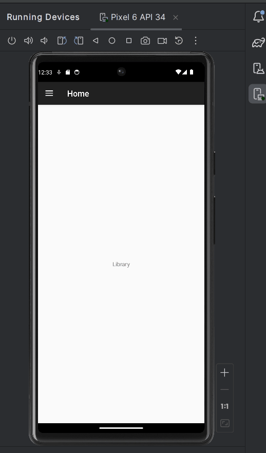
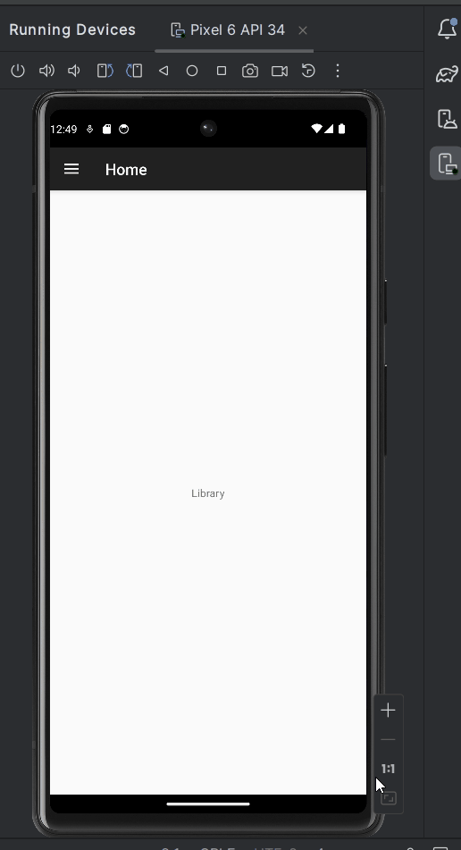
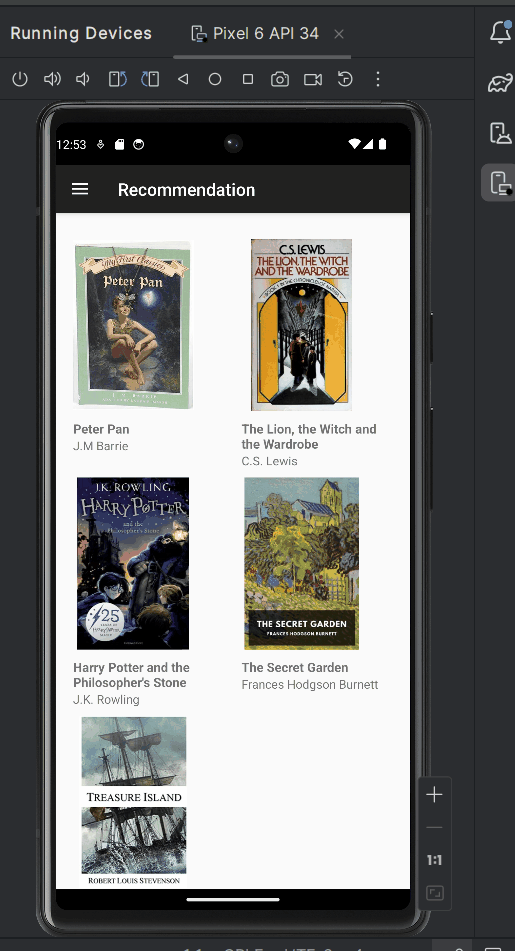

# **ChatGPT-powered Book Recommendations App**

## Table of Contents

1. [App Overview](#App-Overview)
1. [Product Spec](#Product-Spec)
1. [Wireframes](#Wireframes)
1. [Build Notes](#Build-Notes)

## App Overview

### Description

Using ChatGPT, our app suggests books tailored to user preferences, simplifies library organization, provides e-book reading functionality, and fosters community-driven book recommendations. From regular readers engaging in conversation to find their next read, to parents seeking children's books, this app offers a tailored book discovery experience.

### App Evaluation

<!-- Evaluation of your app across the following attributes -->

- **Category:** Books and Literature
- **Description**: An app that leverages the power of ChatGPT to provide personalized and insightful book recommendations to users
- **Mobile:** Mobile is crucial for easy access to the app while reading or shopping for books.
- **Story:** Understands users' reading preferences through natural language conversations, and suggests books tailored to their interests and reading history.
- **Market:** Target bookstores and publishers to allow advertisement along with the genereated book recommendations.
- **Habit:** Readers constantly check new publish books or next books to read. Parents can use to app to look for suitable for their children to read.
- **Scope:** V1 would allow users to fill out the forms to get the recommendations. V2 would allow user to have rounds of conversation with ChatGPT to provide highly personalized recommendations.

## Product Spec

### 1. User Features (Required and Optional)

Required Features:

- [x] User can get list of book recommendations by fill in the forms (Genre Preferences, Reading Level...)
- [x] User can view the book title, author, public year.. etc

Stretch Features:

- [] User can get more personalized book recommendations after rounds of conversation with ChatGPT
- [] User can search the books on the Internet by clicking the itemView

### 2. Chosen API(s)

- **ChatGPT API**

  - User can get list of book recommendations
  - User can get more personalized book recommendations

- **Open Library API**
  - User can view the book title, author, public year.. etc

### 3. User Interaction

Required Feature

- **User can fill the form**

  - => Get a list of book recommendations

- **User can swipe a list of recommended books**
  - => Get detailed informations of the books

## Wireframes

### [BONUS] Digital Wireframes & Mockups

[Figma Wireframe](https://www.figma.com/embed?embed_host=share&url=https%3A%2F%2Fwww.figma.com%2Ffile%2FeqvwuiNs05pmY1YHzKqGXx%2FUntitled%3Ftype%3Ddesign%26node-id%3D0%253A1%26mode%3Ddesign%26t%3DyYnpsCXzBPRaIT8s-1)

### [BONUS] Interactive Prototype

## Build Notes

Here's a place for any other notes on the app, it's creation
process, or what you learned this unit!

For Milestone 2, include **2+ Videos/GIFs** of the build process here!

### Navigation Drawer (Michael)

We first started on creating the foundation of our app. We debated on using a nav drawer or bottom nav bar to move around in our app.
We decided that a drawer would be a cleaner option.

Michael Created the Nav Drawer, meanwhile Gerardo created the questions fragment/page and Hung-Chieh started working on the API section of the code.

### Questions (Gerardo)

Gerardo started creating the questions page that ChatGBT will use to improve the recommendation that we give to the user.

Using spinners will allow us to have control over the users answers, that way they cannot input anything that will make ChatGBT break.

### API/Current (Hung-Chieh)

Hung-Chieh started his own branch and connecting ChatGBT to our app. After finishing he started on the recommendation page and integrated ChatGBT.

## License

Copyright **2023** **Michael Cardoso**

Licensed under the Apache License, Version 2.0 (the "License");
you may not use this file except in compliance with the License.
You may obtain a copy of the License at

    http://www.apache.org/licenses/LICENSE-2.0

Unless required by applicable law or agreed to in writing, software
distributed under the License is distributed on an "AS IS" BASIS,
WITHOUT WARRANTIES OR CONDITIONS OF ANY KIND, either express or implied.
See the License for the specific language governing permissions and
limitations under the License.
